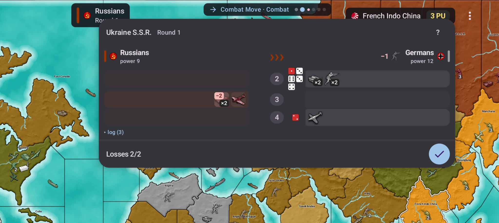
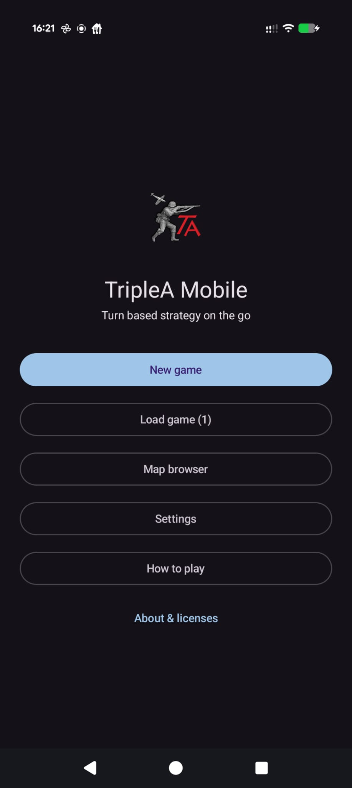
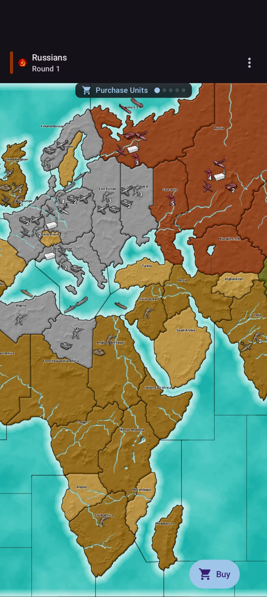
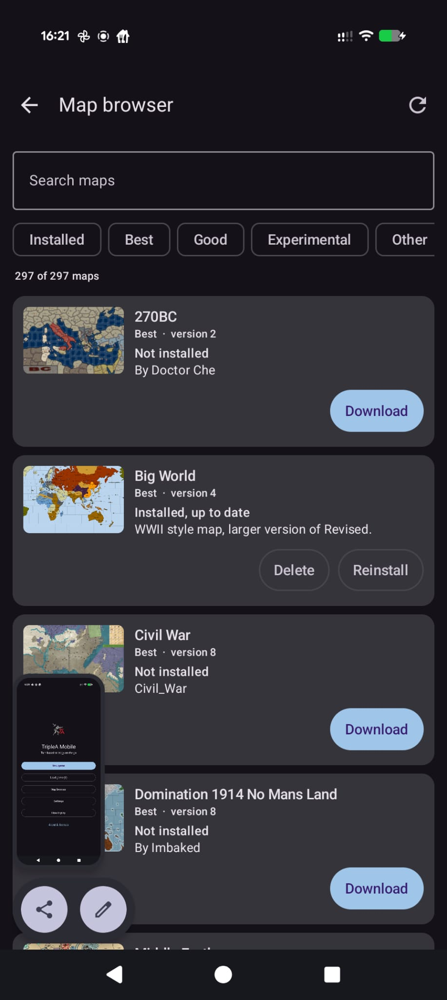

  

<h1 align="center">TripleA Mobile</h1>

<b>Turn based strategy on the go.</b> 
The classic <a href="https://github.com/triplea-game/triplea">TripleA</a> board game engine, now on your Android phone.

  <a href="https://github.com/xXEddieXxx/TripleA-Mobile/releases/latest/download/triplea-mobile.apk"><b>⬇️ Download the latest release</b></a>
  &nbsp;·&nbsp;
  <a href="https://github.com/xXEddieXxx/TripleA-Mobile/releases/download/dev/triplea-mobile-dev.apk">🧪 Dev build</a>
  &nbsp;·&nbsp;
  <a href="https://buymeacoffee.com/xeddie">☕ Buy me a coffee</a>

  

  
  &nbsp;
  
  &nbsp;
  

## What is TripleA Mobile?

TripleA is a free, open source strategy game in the style of *Axis & Allies*: you move armies,
navies and air forces across a map, fight battles with dice, buy new units and try to conquer
the world. The desktop version has been around for many years and has a huge library of
community made maps, from World War II to Napoleon, the Roman Empire or fantasy worlds.

TripleA Mobile brings that game to Android with a touch interface: pinch to zoom, tap a
territory to move, and let the phone do the dice rolling. No account, no ads, no in-app
purchases.

## Features

- **Play against the computer** with three AI levels (Easy, Fast, Hard), or set a nation to
  "Does Nothing" so it only defends itself and stays out of the way.
- **Play with friends on one phone**: pass the device around, hot seat style.
- **Play by file**: save your game, share the save file through any chat or mail app, and your
  friend continues the game on their own phone. A replay in the history tab shows on the map
  what the others did since your last turn, move by move. The same save file opens in the
  desktop TripleA client and vice versa, as long as both run the same engine version.
- **Almost 300 maps**: two maps come with the app, every other map from the TripleA map library
  can be downloaded inside the app. You can also import map zip files from your phone.
- **Battle calculator**: before you attack, check your odds. The calculator simulates the fight
  with the real game rules and shows win chances and expected losses.
- **Game notes and rules** for each map, territory effects, and a "How to play" guide built in.
- **Save and load** as many games as you like.

## Getting started

1. **Install the app.** Download the APK from the link above and open it on your phone. Android
   will ask you to allow installs from this source, since the app is not in the Play Store yet.
   Android 10 or newer is required. New releases install over the old one; a **release** and a
   **dev build** cannot replace each other, so uninstall one before switching to the other.
2. **Start a game.** Tap *New game*, pick a map and decide for every nation whether a human or
   the computer plays it.
3. **Learn the ropes.** The *How to play* screen in the app explains the phases of a turn:
   buy units, move, fight, place new units. Each map also has its own notes with the special
   rules of that scenario.
4. **More maps.** Open the *Map browser*, search or filter, and tap *Download*. Maps are
   downloaded straight from the TripleA map library on GitHub.

There are two downloads. The **release** is the version to play: tested, signed, and updated
every few weeks with a changelog on the
[releases page](https://github.com/xXEddieXxx/TripleA-Mobile/releases). The **dev build** is
rebuilt automatically from every change, so it always has the newest features but may also have
new bugs. If something breaks, please
[open an issue](https://github.com/xXEddieXxx/TripleA-Mobile/issues) and tell us which map you
played, which version (see *About*) and what happened.

## What is not in the app (yet)

- No online multiplayer, no lobby, no play-by-email. Everything happens on your phone.
- The optional rules (technology, repairs, scramble, kamikaze, random start) got their screens
  only recently and have seen less play testing than the rest. See the
  [development notes](docs/DEVELOPMENT.md#known-gaps) for what is still missing.

## Support the project

TripleA Mobile is made in my spare time and is completely free. If you enjoy the app, you can
buy me a coffee. It keeps the maps downloading and the dice rolling.

  <a href="https://buymeacoffee.com/xeddie"><b>☕ Buy me a coffee</b></a>

Bug reports, ideas and feedback are just as welcome, see the
[issue tracker](https://github.com/xXEddieXxx/TripleA-Mobile/issues).

## For developers

The project consists of the TripleA game engine (a Java library, stripped of everything that
needs a desktop) and an Android app written in Kotlin with Jetpack Compose. Building, project
layout, dev builds, security notes and known gaps are documented in
[docs/DEVELOPMENT.md](docs/DEVELOPMENT.md).

## License

TripleA Mobile is free software under the **GNU General Public License v3.0** (see `LICENSE`).
It is an unofficial port and is not affiliated with the TripleA project.

It is based on the [TripleA](https://github.com/triplea-game/triplea) game engine,
Copyright © the TripleA developers, licensed under the GPL-3.0. The engine sources in `engine/`
were modified for Android as described in the [development notes](docs/DEVELOPMENT.md)
(Swing/AWT and networking removed, Java 17 language level, Android resource loading); the unit
images, flags and sounds in `app/src/main/assets` also come from the TripleA project. The
complete corresponding source of the app is this repository.

Third party libraries (Android Jetpack, Kotlin, Guava, Gson, Apache Commons, Woodstox, SnakeYAML
Engine, SLF4J, Lombok, Jakarta XML Binding, JSR-305, JetBrains annotations, desugar_jdk_libs) are
used under their permissive licenses; the app lists them with their licenses under "About".

Maps are made by the TripleA community and live in their own repositories under
[triplea-maps](https://github.com/triplea-maps); each map belongs to its authors and carries its
own terms. The bundled `minimap` comes from the TripleA repository (GPL-3.0); the bundled
`world_war_ii_classic` comes from its triplea-maps repository, which states no license, and is
included in the same way the desktop client distributes it.
